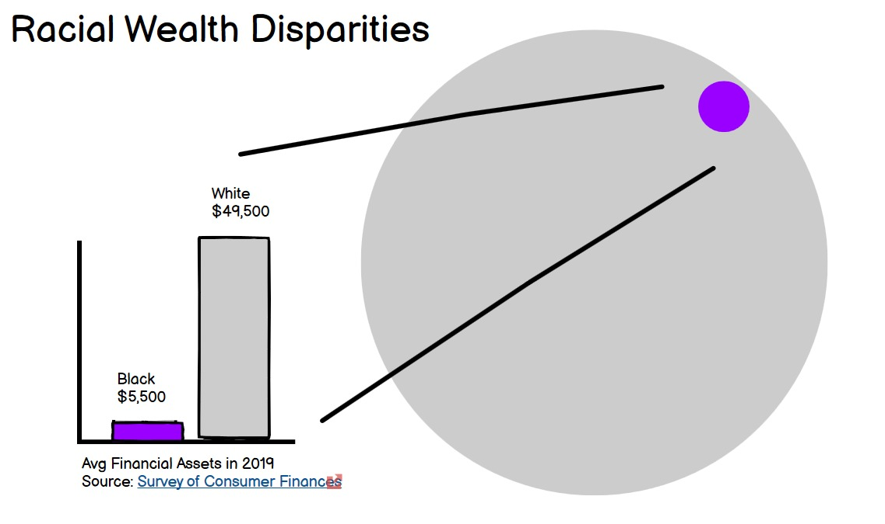

# Critique by Design

## Original Chart

[Source: Survey of Consumer Finances](https://www.federalreserve.gov/econres/scf/dataviz/scf/chart/#range:1989,2019;series:Financial_Assets;demographic:racecl4;population:1,2;units:median)

## Example Chart

[Source: Visualizing Health](http://www.vizhealth.org/gallery/assets/44/)

## Redesign 1

###Critique 1
    I think this is a graph that is showing disparities between white and black wealth. I believe it’s telling me that blacks hold a very small amount t of wealth compared to whites. Probably the general public. The lines there are a bit confusing. I’m assuming you’re trying to zoom out?   to show what it means? May be better to just have one representation of this data instead of two.
###Critique 2
  Maybe put the grey bar first and then purple. Bc right now it looks like my attn is trying to connect the purple dot to the grey bar.
 ###Critique 3
 So I can tell that the purple graph element and the pruple dot are supposed to represnt the average financial assets of a black households (I'm assuming) relative to the average financial assets to white households. But I am struggling to understand why its both as supposed to one or the other. As far as content, I imagine that the intended audience is anybody doing anything related to financial inequality or generational wealth differences and policy. Things I would change or do differently: if there is no separate function to having the circles, I'd pick one or the other. Adding a blurb to give context to the racial wealth disparities specifically highlighting that its disparities in assets. Give context around why the speculation is for assets because assets is disticnt and usually the focus is on income. 
    

[BACK](/README.md)
